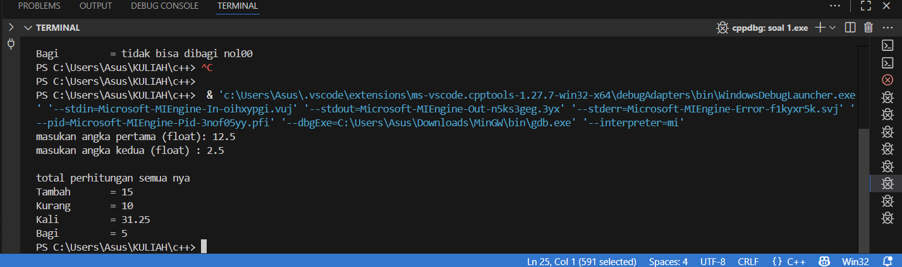
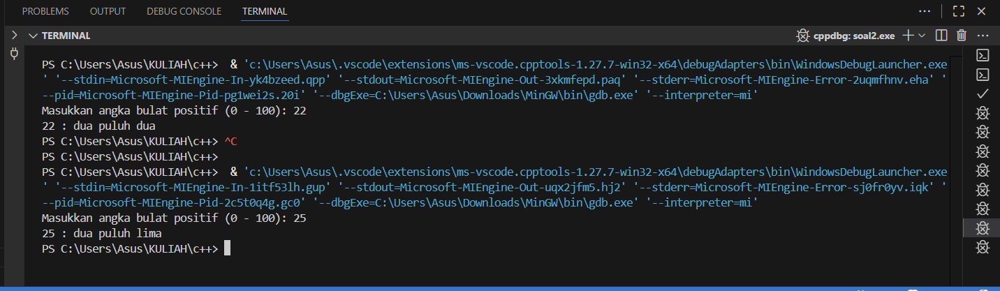
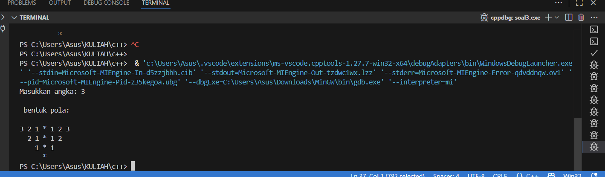

# <h1 align="center">Laporan Praktikum Modul 1 <br>  CODE BLOCKS IDE & PENGENALAN BAHASA C++</h1>
<p align="center">elfan endriyanto - 103112430040</p>

## Dasar Teori

Bahasa pemrograman C++ adalah salah satu bahasa tingkat tinggi yang banyak dimanfaatkan baik di lingkungan pendidikan maupun industri. Pada umumnya, susunan program C++ diawali dengan header file seperti #include, yang berfungsi untuk mendukung proses input dan output standar. Menurut pendapat Indahyati dan Rahmawati (2020), C++ menjadi dasar penting dalam memahami konsep algoritma serta pemrograman, terutama karena struktur sintaksnya relatif sederhana dan mudah dipahami oleh pemula.


## Guided

### soal 1

aku mengerjakan perulangan

## Unguided

### Soal 1

```go
#include <iostream>
using namespace std;

int main() {
    float x, y;

    cout << "masukan angka pertama (float): ";
    cin >> x;
    cout << "masukan angka kedua (float) : ";
    cin >> y;

    cout << "\n total perhitungan semua nya" << endl;
    cout << "Tambah       = " << x + y << endl;
    cout << "Kurang       = " << x - y << endl;
    cout << "Kali         = " << x * y << endl;

    if (y == 0) {
        cout << "Bagi         = tidak bisa dibagi nol00" << endl;
    } else {
        cout << "Bagi         = " << (x / y) << endl;
    }

    return 0;
}

```

> Output
> 

Pada soal Unguided 1, program yang dibuat tergolong mudah. Saya diminta mendeklarasikan dua buah variabel dengan tipe data float untuk menampung nilai masukan dari pengguna. Nilai tersebut kemudian diproses menggunakan operasi aritmatika dasar. Selain itu, saya menambahkan aturan sederhana berupa pengecekan pada bagian pembagian, karena tidak mungkin sebuah bilangan dibagi dengan nol.

### Soal 2

```go
#include <iostream>
#include <string>
using namespace std;

string sebutangka(int n) {
    string angkadasar[] = {"nol", "satu", "dua", "tiga", "empat",
                           "lima", "enam", "tujuh", "delapan", "sembilan"};

    if (n == 0) return "nol";
    if (n == 100) return "seratus";

    if (n < 10) {
        return angkadasar[n];
    } 
    else if (n < 20) {
        if (n == 10) return "sepuluh";
        if (n == 11) return "sebelas";
        return angkadasar[n % 10] + " belas";
    } 
    else {
        string hasil = angkadasar[n / 10] + " puluh";
        if (n % 10 != 0) {
            hasil += " " + angkadasar[n % 10];
        }
        return hasil;
    }
}

int main() {
    int angka;
    cout << "Masukkan angka bulat positif (0 - 100): ";
    cin >> angka;

   cout << angka << " : " << sebutangka(angka) << endl;

    return 0;
}

```

> Output
> 

penjelasan kode

Program pada soal Unguided 2 terasa lebih menantang dibanding sebelumnya. Di dalam program, saya membuat sebuah fungsi bernama sebutAngka(int n) yang bertugas memproses angka sesuai dengan aturan tertentu. Apabila input bernilai 0, maka fungsi akan mengembalikan kata “nol”, sedangkan jika bernilai 100 hasilnya adalah “seratus”. Untuk angka kurang dari 10, program langsung mengambil kata yang sesuai dari array satuan. Khusus untuk rentang 10–19, digunakan aturan khusus, misalnya 10 menjadi “sepuluh”, 11 menjadi “sebelas”, sementara 12 hingga 19 akan dikonversi menjadi bentuk [satuan] belas. Sementara itu, angka 20 sampai 99 dibentuk dengan menuliskan nilai puluhannya, seperti “dua puluh” atau “tiga puluh”, lalu ditambahkan kata satuan jika angkanya tidak genap puluhan.

### Soal 3

```go
#include <iostream>
using namespace std;

void Mirror(int n) {
    for (int baris = n; baris >= 1; baris--) {
        for (int jarak = 0; jarak < n - baris; jarak++) {
            cout << "  ";
        }
        for (int kiri = baris; kiri >= 1; kiri--) {
            cout << kiri << " ";
        }
        cout << "*";
        for (int kanan = 1; kanan <= baris; kanan++) {
            cout << " " << kanan;
        }
        cout << endl;
    }

     if (n >= 1) {
        for (int jarak = 0; jarak < n; jarak++) {
            cout << "  ";
        }
         cout << "* " << endl;
    }
}

int main() {
    int jumlah;
    cout << "Masukkan angka: ";
    cin >> jumlah;

    cout << "\n bentuk pola:\n\n";
    Mirror(jumlah);

    return 0;
}

```

> Output
> 

Pada soal Unguided 3, tingkat kesulitannya relatif mudah karena saya sudah pernah melakukan praktik serupa sebelumnya, meskipun terdapat sedikit perbedaan pada implementasi. Secara garis besar algoritmanya tidak jauh berbeda, namun dari latihan ini saya mendapatkan pemahaman baru terkait perbedaan penggunaan pre-increment/decrement dan post-increment/decrement. Alur kerjanya bisa dijelaskan sebagai berikut: for loop pertama mengatur jumlah baris yang dicetak dari atas ke bawah, for loop kedua digunakan untuk mencetak spasi agar pola tampak bergeser ke kanan, for loop ketiga menghasilkan deret angka menurun dari nilai tertentu hingga 1, sedangkan for loop keempat mencetak deret angka menaik dari 1 kembali ke nilai semula setelah tanda bintang. Selain itu, terdapat tambahan for loop di dalam blok if yang berfungsi untuk menampilkan spasi terakhir pada baris paling bawah, kemudian mencetak satu bintang sebagai penutup sehingga bentuk cerminnya menjadi utuh.


## Referensi

1. https://en.wikipedia.org/wiki/Data_structure (diakses blablabla)
