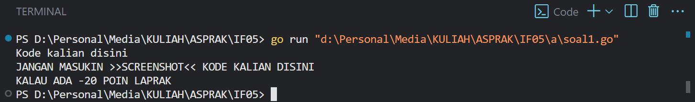
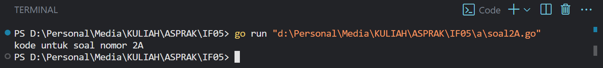
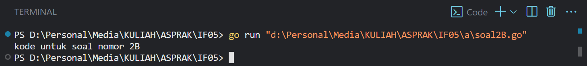

# <h1 align="center">Laporan Praktikum Modul 1 <br>  CODE BLOCKS IDE & PENGENALAN BAHASA C++</h1>
<p align="center">elfan endriyanto - 103112430040</p>

## Dasar Teori

Bahasa pemrograman C++ adalah salah satu bahasa tingkat tinggi yang banyak dimanfaatkan baik di lingkungan pendidikan maupun industri. Pada umumnya, susunan program C++ diawali dengan header file seperti #include, yang berfungsi untuk mendukung proses input dan output standar. Menurut pendapat Indahyati dan Rahmawati (2020), C++ menjadi dasar penting dalam memahami konsep algoritma serta pemrograman, terutama karena struktur sintaksnya relatif sederhana dan mudah dipahami oleh pemula.


## Guided

### soal 1

aku mengerjakan perulangan

## Unguided

### Soal 1

```go
#include <iostream>
using namespace std;

int main() {
    float x, y;

    cout << "masukan angka pertama (float): ";
    cin >> x;
    cout << "masukan angka kedua (float) : ";
    cin >> y;

    cout << "\n total perhitungan semua nya" << endl;
    cout << "Tambah       = " << x + y << endl;
    cout << "Kurang       = " << x - y << endl;
    cout << "Kali         = " << x * y << endl;

    if (y == 0) {
        cout << "Bagi         = tidak bisa dibagi nol00" << endl;
    } else {
        cout << "Bagi         = " << (x / y) << endl;
    }

    return 0;
}

```

> Output
> 
> %% Untuk mencantumkan screenshot, tidak boleh ada spasi di urlnya `()`, penamaan file bebas asal gak sara dan mudah dipahami aja,, dan jangan lupa hapus komen ini yah%%

Penjelasan ttg kode kalian disini

### Soal 2

```go
#include <iostream>
#include <string>
using namespace std;

string sebutangka(int n) {
    string angkadasar[] = {"nol", "satu", "dua", "tiga", "empat",
                           "lima", "enam", "tujuh", "delapan", "sembilan"};

    if (n == 0) return "nol";
    if (n == 100) return "seratus";

    if (n < 10) {
        return angkadasar[n];
    } 
    else if (n < 20) {
        if (n == 10) return "sepuluh";
        if (n == 11) return "sebelas";
        return angkadasar[n % 10] + " belas";
    } 
    else {
        string hasil = angkadasar[n / 10] + " puluh";
        if (n % 10 != 0) {
            hasil += " " + angkadasar[n % 10];
        }
        return hasil;
    }
}

int main() {
    int angka;
    cout << "Masukkan angka bulat positif (0 - 100): ";
    cin >> angka;

   cout << angka << " : " << sebutangka(angka) << endl;

    return 0;
}

```

> Output
> 

penjelasan kode

Kalau adalanjutan di lanjut disini aja

### Soal 3

```go
#include <iostream>
using namespace std;

void Mirror(int n) {
    for (int baris = n; baris >= 1; baris--) {
        for (int jarak = 0; jarak < n - baris; jarak++) {
            cout << "  ";
        }
        for (int kiri = baris; kiri >= 1; kiri--) {
            cout << kiri << " ";
        }
        cout << "*";
        for (int kanan = 1; kanan <= baris; kanan++) {
            cout << " " << kanan;
        }
        cout << endl;
    }

     if (n >= 1) {
        for (int jarak = 0; jarak < n; jarak++) {
            cout << "  ";
        }
         cout << "* " << endl;
    }
}

int main() {
    int jumlah;
    cout << "Masukkan angka: ";
    cin >> jumlah;

    cout << "\n bentuk pola:\n\n";
    Mirror(jumlah);

    return 0;
}

```

> Output
> 

penjelasan bedanya sesuai soal

## Referensi

1. https://en.wikipedia.org/wiki/Data_structure (diakses blablabla)
